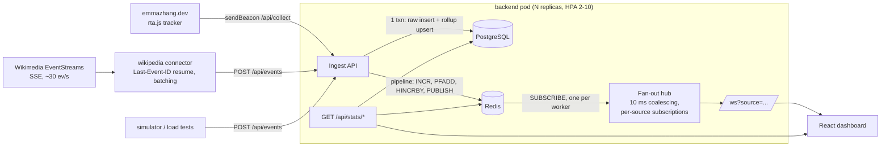

# Real-Time Analytics Dashboard

A real-time analytics platform that ingests **two live event streams**, persists them to
PostgreSQL, fans them out through Redis pub/sub, and pushes them to browser dashboards over
WebSocket with sub-100 ms latency.

| Stream | What it is | What the dashboard answers |
|---|---|---|
| **Wikipedia Live** (`source=wikipedia`) | Every edit, page creation, log action and category change across all Wikimedia projects, from the public [EventStreams](https://stream.wikimedia.org/v2/ui/) `recentchange` feed. ~30 events/s, **~2.5M events/day**. | How much is changing right now? Which wikis are most active? What share of changes are made by bots? Who is editing? |
| Website tracker (`source=site`, API only, not shown on the dashboard) | First-party tracker (`tracker/rta.js`) on [emmazhang.dev](https://emmazhang.dev/). | How many people are on my site right now? How many come from my LinkedIn posts (vs GitHub, Google, Handshake…)? Which pages do they read, and do they click through to GitHub or my resume? |
| Simulator (`source=demo`, API only, not shown on the dashboard) | Synthetic traffic from `scripts/simulate.py`. | Load and latency benchmarks. |

**Stack:** Python · Flask · gevent/gunicorn · flask-sock (WebSocket) · Redis (pub/sub, HyperLogLog,
counters) · PostgreSQL · React + Vite + Recharts · Docker · Kubernetes (HPA, PDB, Ingress)



## How it works

| Concern | Design |
|---|---|
| **Wikipedia connector** | Async SSE client (`connectors/wikipedia.py`). Tracks the stream's `id:` and reconnects with `Last-Event-ID`, so a dropped connection resumes exactly where it stopped. Jittered exponential back-off (honours `retry:`). Batches to the ingest API every 250 ms / 200 events; bounded buffer if the backend is down (oldest dropped and counted). Runs as a single-replica `Recreate` Deployment so events are never double-counted during a rollout. |
| **Website tracker** | `rta.js` (≈150 lines, no dependencies): `page_view` (incl. SPA route changes), `link_click` classified as github / linkedin / resume / email / project / external, `engaged` after 30 s of visible time. Traffic source is resolved once per session from `utm_source` or the referrer (`linkedin.com` and `lnkd.in` → linkedin). Sends `text/plain` beacons, so no CORS preflight. No cookies, IPs or fingerprinting; a random visitor id in localStorage; Do Not Track / GPC and automated browsers are skipped. |
| **Ingest** | `POST /api/events` (trusted producers) and `POST /api/collect` (browser beacons: origin allow-list, bot user-agent filter, per-IP rate limit, source forced to `site`). Raw rows (`execute_values`) and the per-minute rollup upsert (`ON CONFLICT`, sorted keys so concurrent writers can't deadlock) are written in **one transaction**. |
| **Live counters** | One Redis pipeline per batch, keyed by source: per-minute and daily counters; HyperLogLog for unique users (5-min active and unique-today, ~0.8% error, 12 KB per key); per-minute hashes for top-N breakdowns (wiki, bot, referrer, click target, page); the recent-events feed; and `PUBLISH`. |
| **Fan-out** | Each gunicorn worker holds **one** Redis subscription, not one per client. A flusher coalesces messages for 10 ms, groups them by source, serializes **once per source**, and only for sources someone is watching. Each client gets a bounded queue; slow consumers drop frames instead of slowing everyone down. Any pod can ingest and every pod's viewers see the event, so the WebSocket tier scales horizontally behind a plain load balancer without sticky sessions. |
| **Storage** | `events(source, event_type, user_id, value, props jsonb, occurred_at, …)` with `BRIN(occurred_at)`, `B-tree(source, event_type, occurred_at DESC)`, `B-tree(user_id, occurred_at DESC)`; `event_rollup_minute` (PK `source, bucket, event_type`). Charts read the rollup and never scan raw events. |
| **Frontend** | One tab per stream, one WebSocket subscription per tab. Frames are buffered and committed to React state every 250 ms. Latency is measured when a frame arrives, not at commit time. The 60-min aggregates are re-synced from REST every minute so the window keeps sliding. Only completed minutes are plotted. Colors are fixed per event type and come from a CVD-validated palette, in light and dark. |
| **Ops** | `/healthz` (liveness), `/readyz` (DB + Redis), `/metrics` (Prometheus: ingest latency histogram, ws clients gauge, frames sent). |
| **K8s** | Backend Deployment: readiness/liveness probes, `maxUnavailable: 0` rolling updates, `preStop` drain, topology spread, PDB `minAvailable: 1`, HPA on CPU 65% / memory 75% (2→10 pods, fast scale-up, slow scale-down so sockets aren't dropped needlessly). Also: wikipedia connector, Postgres StatefulSet + PVC, Redis, frontend (+HPA), and ingress-nginx with 1 h socket timeouts. |

## Measured results

Measured on a **2 vCPU** cloud sandbox with Postgres, Redis, the backend (gunicorn, 4 gevent
workers), the Wikipedia connector (30 events/s) **and** the load generator all on the same box.
That's a pessimistic setup.

| Resume claim | How to reproduce | Result |
|---|---|---|
| 100K+ daily events | Wikipedia stream; `python scripts/simulate.py --rate 5000 --batch 100 --total 100000` | The real Wikipedia stream alone is **~30 events/s ≈ 2.5M/day** (sampled live: 329 events in 10 s). Burst ingest: **100,000 events in ~35 s (≈2.8K events/s)** while the Wikipedia stream was running. |
| Sub-100 ms latency | `python scripts/bench_ws.py --clients 1 --events 300` | HTTP POST → Postgres commit → Redis PUBLISH → pod → WebSocket frame: **p50 15 ms, p95 18 ms, p99 21 ms** |
| 1K+ concurrent users | `python scripts/bench_ws.py --clients 1000 --events 100` | **1000/1000 sockets connected in 1.4 s, 100,000/100,000 deliveries (0 dropped), p50 58 ms, p95 87 ms, p99 103 ms**, with Wikipedia traffic flowing at the same time |
| 5M+ records, query time −50% | `python scripts/bench_query.py --seed 5000000` | 5,014,299 rows. Average of 3 dashboard queries: **273 ms (no index) → 82 ms (indexes, −70%) → 5.5 ms (indexed rollup, −98%)** |
| 99.8% uptime on K8s | `python scripts/uptime_probe.py --url https://<host> --minutes 60` while running `kubectl rollout restart`, deleting pods, and driving the HPA with load | **Not measured here** (no cluster in the sandbox). The manifests pass `kubeconform -strict` (16/16 resources valid). Run the probe on minikube, kind or EKS to get your own number. |

**Fan-out finding.** The first 1K-client run after adding Wikipedia pushed every stream to every
socket, and it measured p50 171 ms / p95 353 ms. Per-source subscriptions (`/ws?source=…`)
fixed it: each dashboard only receives the stream it shows, and the server serializes once per
watched source. That brought it back to p50 58 ms / p95 87 ms.

Query benchmark detail (5,014,299 events, 258,919 rollup rows, mean of 5 warm runs):

| Query | A: raw, no secondary index | B: raw + BRIN + composite B-tree | C: per-minute rollup |
|---|---|---|---|
| per-minute series, 24 h | 304.0 ms | 148.3 ms | 13.6 ms |
| breakdown by type, 24 h | 244.6 ms | 94.4 ms | 2.0 ms |
| `purchase` drill-down, 6 h | 269.0 ms | 2.4 ms | 0.8 ms |

**Verified behaviour:**
- **Connector resume:** against a mock SSE server that dropped the connection every 70 events, the connector resumed at offsets 70 and 140 with no gaps and no duplicates (200/200 delivered).
- **Tracker:** headless-browser visitors arriving from `linkedin.com/feed`, `lnkd.in`, `github.com`, `google.com` and `?utm_source=handshake` were all attributed correctly. GitHub, resume, email and project clicks were classified correctly, and `engaged` fired after 30 s. Automated browsers and bot user agents are dropped, as intended.

## Put the tracker on emmazhang.dev

1. Deploy the backend somewhere with **HTTPS** (your site is HTTPS, so beacons to plain HTTP are blocked as mixed content). Any of: the k8s manifests, `docker compose` on a small VM behind Caddy, or Render / Fly.io / Railway.
2. Make sure `COLLECT_ORIGINS` includes `https://emmazhang.dev` (it does by default).
3. Add one line before `</body>` (or in your layout component):
   ```html
   <script defer src="https://YOUR-DASHBOARD-HOST/rta.js"
           data-endpoint="https://YOUR-DASHBOARD-HOST/api/collect"></script>
   ```
4. Tag the links in your LinkedIn posts, for example `https://emmazhang.dev/?utm_source=linkedin&utm_campaign=github-post`. LinkedIn often strips the referrer, so the UTM tag makes attribution reliable.

## Run it

### macOS, one double-click
Double-click **`start.command`**. If Docker is running it uses `docker compose`; otherwise it
needs nothing pre-installed except Xcode Command Line Tools: Python 3.12 comes from `uv`,
PostgreSQL 16 from the `pgserver` wheel, Redis is built from source once (~1 min), and the
prebuilt dashboard in `frontend/dist` is served by the backend. It connects to the **live**
Wikipedia stream and opens http://localhost:5050 (not :5000, which macOS reserves for AirPlay).
Logs are in `.run/`.

### Docker Compose
Run these commands from the repo root:

```bash
cd /path/to/23-realtime-analytics-dashboard

# If Docker Desktop is not already running on macOS:
open -a Docker
docker info                                                # wait until this succeeds

docker compose up --build                                  # dashboard: http://localhost:8080
```

Optional load/demo commands, also from the repo root:

```bash
docker compose --profile demo up simulator                 # synthetic traffic
docker compose up --scale backend=3                        # cross-pod fan-out demo
docker compose down                                        # stop everything
```

### Local, manual (no Docker)
Use this path only if Postgres and Redis are already running locally:

- Postgres: `localhost:5432`, database `analytics`, user/password `postgres/postgres`
- Redis: `localhost:6379`

Start each long-running process in its own terminal. All commands begin from the repo root.

Install Python dependencies once:

```bash
cd /path/to/23-realtime-analytics-dashboard
python3 -m venv .venv
source .venv/bin/activate
python -m pip install -r backend/requirements.txt -r connectors/requirements.txt
```

Terminal 1 - backend:

```bash
cd /path/to/23-realtime-analytics-dashboard
source .venv/bin/activate
cd backend
gunicorn -c gunicorn.conf.py wsgi:app                      # backend: http://localhost:5000
```

Terminal 2 - frontend:

```bash
cd /path/to/23-realtime-analytics-dashboard
cd frontend
npm install
npm run dev                                                # dashboard: http://localhost:5173
```

Terminal 3 - live Wikipedia stream:

```bash
cd /path/to/23-realtime-analytics-dashboard
source .venv/bin/activate
python connectors/wikipedia.py                            # posts to http://localhost:5000
```

Optional synthetic traffic:

```bash
cd /path/to/23-realtime-analytics-dashboard
source .venv/bin/activate
python scripts/simulate.py --rate 15 --batch 3
```

Offline connector replay:

```bash
cd /path/to/23-realtime-analytics-dashboard
source .venv/bin/activate
python connectors/wikipedia.py --replay connectors/fixtures/wikimedia_recentchange_sample.jsonl
```

If your shell says `pip: command not found`, use `python -m pip` inside the activated
virtualenv as shown above. If `cd backend` says `no such file or directory`, you are probably
already inside `backend`; run `pwd` to check, or `cd ..` to return to the repo root.

### Vercel (serverless demo)
The repo deploys to Vercel as-is (`vercel.json`): the React app is built from `frontend/`,
and the same Flask app runs as a Python function (`api/index.py`). Vercel has no WebSockets
or always-on processes, so in this mode the backend switches automatically:

| Always-on deployment (Docker / K8s / local) | Vercel |
|---|---|
| WebSocket push, Redis pub/sub fan-out | HTTP polling of `/api/live` with an id cursor (~1 s latency) |
| Always-on Wikipedia connector | `/api/ingest/wikipedia`: pulled on demand while someone has the dashboard open. A Postgres advisory lock means concurrent viewers share one pull; back-to-back pulls resume via Last-Event-ID |
| Redis counters, HyperLogLog, top-N hashes | Same numbers computed in Postgres (Redis is used if `REDIS_URL` is set) |
| Raw events kept | Raw Wikipedia rows pruned after `WIKI_RETENTION_HOURS` (default 48); rollups kept |

Setup: import the repo in Vercel → **Storage → Create Database → Neon (Postgres)** and connect
it to the project with the env prefix `DATABASE` (this sets `DATABASE_URL` and
`DATABASE_URL_UNPOOLED`; the latter is used for the pull lock) → redeploy. Tables are created
on first request.

### Kubernetes (minikube / kind / EKS)
```bash
docker build -f backend/Dockerfile -t ghcr.io/jiajunwang23/rta-backend:latest .
docker build -t ghcr.io/jiajunwang23/rta-frontend:latest frontend
docker build -t ghcr.io/jiajunwang23/rta-wikipedia-connector:latest connectors
# push all three, (k8s/ already points at ghcr.io/jiajunwang23)
kubectl apply -f k8s/
kubectl -n analytics get hpa -w                            # needs metrics-server
```

## API

| Method | Path | Notes |
|---|---|---|
| POST | `/api/events` | `{source?, type, user_id, value?, props?, ts?}` or `{events:[...]}` → `202 {accepted}` |
| POST | `/api/collect` | browser beacons (text/plain JSON `{events:[...]}`, ≤20), source forced to `site` |
| GET | `/api/stats/summary` | live KPIs for every source (Redis) |
| GET | `/api/stats/timeseries?source=&minutes=60` | per-minute counts by type (rollup) |
| GET | `/api/stats/breakdown?source=&minutes=60` | totals by type (rollup) |
| GET | `/api/stats/dims?source=&key=&minutes=60` | top-N for `ref_source`, `path`, `target`, `wiki`, `bot` |
| GET | `/api/events/recent?source=&limit=50` | latest events |
| GET | `/rta.js` | website tracker |
| WS | `/ws?source=` | frames: `hello`, `events` (batched, that source only), `stats` (1 Hz, all sources), `ping` |

## Interview notes: trade-offs worth explaining

- **Why not pull data from LinkedIn?** There's no public real-time API, and scraping breaks
  LinkedIn's terms. The tracker measures what LinkedIn *does* for me (visitors and clicks it
  sends to my site) with first-party data.
- **Why Redis pub/sub and not Kafka?** Pub/sub is fire-and-forget: a pod that's down misses
  messages. That's acceptable here because Postgres is the source of truth and clients re-seed
  from REST when they reconnect. If replay or consumer groups mattered, I'd switch to Redis
  Streams or Kafka. The Wikipedia side gets replay from Last-Event-ID instead.
- **Why a rollup table and not just indexes?** Indexes made time-window queries ~3× faster; the
  rollup made them ~50× faster, because the dashboard reads pre-aggregated rows instead of every
  raw event. The cost is one extra upsert per (minute, source, type) per batch.
- **Why coalesce for 10 ms, and why per-source subscriptions?** At 1K clients the cost is socket
  writes and serialization. Batching trades at most 10 ms of latency for an order of magnitude
  fewer writes. Subscriptions stop clients from receiving streams they don't render.
- **Scaling the write path further:** partition `events` by day (`PARTITION BY RANGE`), switch to
  `COPY`, or put a queue in front and batch-insert asynchronously.
- **HPA and WebSockets:** CPU-based HPA works, but scaling down kills sockets. Hence the
  5-minute stabilization window, the PDB, and client back-off. A custom metric (`ws_clients` per
  pod via prometheus-adapter) would be a better scaling signal long-term.

## Layout
```
backend/     Flask app (app/), gunicorn config, Dockerfile (build context = repo root)
frontend/    React dashboard, nginx.conf, Dockerfile
connectors/  wikipedia.py (EventStreams -> ingest), real recorded sample for offline replay
tracker/     rta.js, the website tracker served at /rta.js
k8s/         namespace, config, postgres, redis, backend (+HPA, PDB), connector, frontend (+HPA), ingress
scripts/     simulate.py, bench_ws.py, bench_query.py, uptime_probe.py
```
