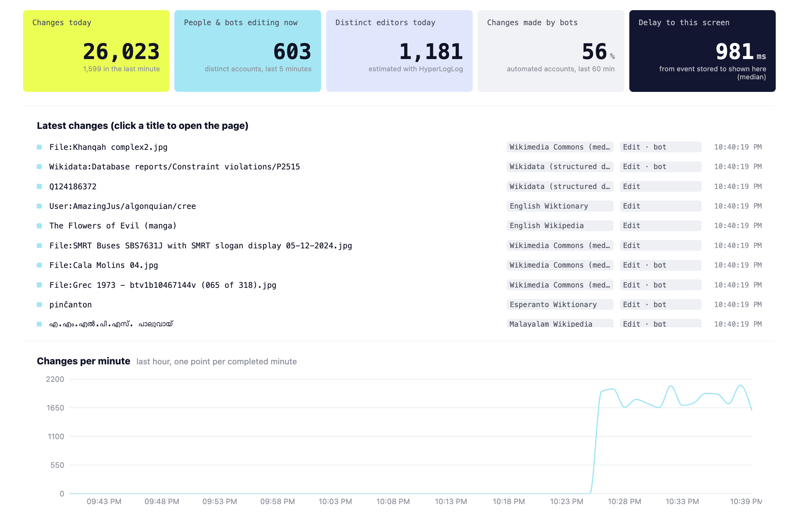
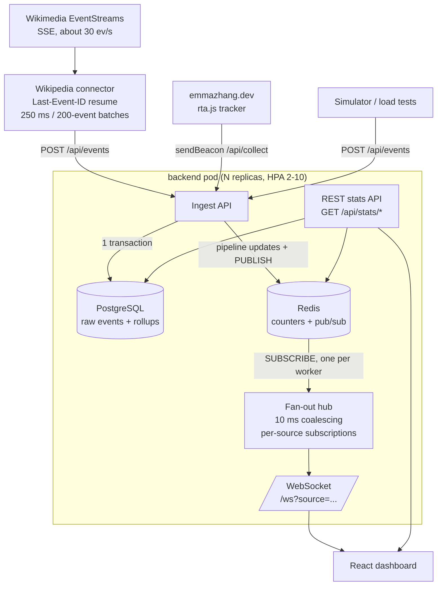

# Real-Time Analytics Dashboard

I built this as a production-style analytics system: events come in continuously,
the backend stores them, and the dashboard updates live without refreshing the
page.

The goal was not just to make a chart move. I wanted to practice the parts of
backend and infrastructure work that usually show up in real systems: ingesting
messy live data, keeping queries fast as the database grows, pushing updates to
many connected users, and deploying the same app in local, serverless, and
Kubernetes environments.



The project currently tracks three streams:

| Stream | Source | Used for |
|---|---|---|
| Wikipedia Live | Wikimedia [EventStreams](https://stream.wikimedia.org/v2/ui/) `recentchange` feed | Shows live edit activity across Wikimedia projects |
| Website tracker | `tracker/rta.js` on [emmazhang.dev](https://emmazhang.dev) | Measures first-party visits, referrers, page views, and outbound clicks |
| Simulator | `scripts/simulate.py` | Generates traffic for load tests and demos |

**Stack:** Python, Flask, gevent/gunicorn, flask-sock, Redis, PostgreSQL, React,
Vite, Recharts, Docker, Kubernetes.

## What This Project Shows

| What I worked on | What that means in plain English |
|---|---|
| Real-time ingest | The app listens to the public Wikipedia edit stream, which is about 30 events per second, and accepts custom website analytics events too. |
| Live dashboard updates | New events are pushed to the browser over WebSockets instead of waiting for the user to refresh. |
| Scalable fan-out | Redis pub/sub lets any backend pod receive an event and broadcast it to viewers connected to other pods. |
| Fast dashboard queries | The app keeps raw events but also writes per-minute rollups, so charts stay fast even after millions of rows. |
| Load testing | I wrote benchmark scripts for ingest throughput, WebSocket latency, concurrent clients, and query performance. |
| Deployment practice | The repo includes Docker Compose, a Vercel serverless mode, and Kubernetes manifests with health checks and autoscaling. |

## Results

| Measurement | Result |
|---|---|
| Live input rate | About 30 Wikipedia events/s, roughly 2.5M events/day |
| Burst ingest | 100,000 synthetic events in about 35 s while the live Wikipedia stream was also running |
| WebSocket latency | p50 15 ms, p95 18 ms, p99 21 ms from HTTP ingest to browser frame |
| Concurrent viewers | 1,000 sockets, 100,000/100,000 deliveries, 0 dropped frames in the benchmark run |
| Query speed | Dashboard queries improved from 273 ms raw scans to 5.5 ms with indexed rollups on 5M+ rows |
| Kubernetes checks | 16/16 manifests pass `kubeconform -strict` |

## If You Are Skimming

The most interesting parts to look at are:

| File or folder | Why it matters |
|---|---|
| `backend/app/` | Flask API, ingest path, rollup writes, Redis counters, and WebSocket fan-out |
| `connectors/wikipedia.py` | Live Wikipedia stream consumer with reconnect/resume behavior |
| `tracker/rta.js` | Small first-party analytics tracker for my personal site |
| `scripts/bench_ws.py` | WebSocket latency and concurrent-client benchmark |
| `scripts/bench_query.py` | Query benchmark showing why the rollup table matters |
| `k8s/` | Deployment manifests for running the system as multiple services |

Good interview discussion topics from this project: why I used Redis pub/sub
instead of Kafka, how the rollup table changed query performance, how WebSocket
fan-out behaves with many clients, and what changes I would make if this needed
to handle much higher write volume.

## Architecture

At a high level, there are three jobs:

1. Collect events from live sources.
2. Store enough detail to debug or re-query later, while also keeping fast
   aggregates for the dashboard.
3. Push fresh updates to every connected browser without making each browser
   poll the backend constantly.



## How The Pieces Work

### Ingesting live data

The Wikipedia connector is a small service that listens to Wikimedia's public
server-sent events stream. If the connection drops, it reconnects with
`Last-Event-ID` so it can continue from the last event it saw. It also batches
events before sending them to the backend, which is much cheaper than posting
one request per edit.

The website tracker is a small browser script. It records page views, route
changes, outbound link clicks, and whether a visitor stayed engaged for at least
30 seconds. It avoids cookies, IP tracking, and fingerprinting; the point is to
measure useful product analytics without collecting more personal data than the
project needs.

### Storing and querying events

Every event is stored in PostgreSQL so the raw data is still available. At the
same time, the backend updates a per-minute rollup table. The dashboard reads
from the rollup table for charts, which is why queries stay fast even after the
raw table grows into millions of rows.

For live numbers, Redis keeps lightweight counters, top-N breakdowns, recent
events, and approximate unique-user counts. PostgreSQL is still the source of
truth; Redis is used for fast live reads and fan-out.

### Pushing updates to the dashboard

When a new batch arrives, the backend publishes a message through Redis. Each
backend worker has one Redis subscription, and each browser connected to that
worker gets the relevant update over WebSocket.

I originally sent every stream to every socket. That worked, but it became
wasteful with 1,000 connected clients. The current version uses per-source
subscriptions, so a browser looking at Wikipedia data does not receive website
tracker events it will never render.

### Running it like a real service

The backend exposes `/healthz`, `/readyz`, and `/metrics` so it can be monitored
and restarted safely. The Kubernetes manifests include readiness/liveness
probes, a PodDisruptionBudget, autoscaling, a preStop drain, and ingress settings
for long-lived WebSocket connections.

## Quick Start

### macOS, one double-click

Double-click `start.command`.

If Docker is running, it uses `docker compose`. Otherwise it needs only Xcode
Command Line Tools: Python comes from `uv`, PostgreSQL 16 from the `pgserver`
wheel, Redis is built from source once, and the prebuilt dashboard in
`frontend/dist` is served by the backend.

The app connects to the live Wikipedia stream and opens:

```text
http://localhost:5050
```

Logs are written to `.run/`.

### Docker Compose

Run from the repo root:

```bash
cd /path/to/23-realtime-analytics-dashboard

# If Docker Desktop is not already running on macOS:
open -a Docker
docker info

docker compose up --build
```

Dashboard:

```text
http://localhost:8080
```

Optional demo and scale commands:

```bash
docker compose --profile demo up simulator
docker compose up --scale backend=3
docker compose down
```

### Local, manual

Use this path only if Postgres and Redis are already running locally:

| Service | Local default |
|---|---|
| Postgres | `localhost:5432`, database `analytics`, user/password `postgres/postgres` |
| Redis | `localhost:6379` |

Install Python dependencies once:

```bash
cd /path/to/23-realtime-analytics-dashboard
python3 -m venv .venv
source .venv/bin/activate
python -m pip install -r backend/requirements.txt -r connectors/requirements.txt
```

Start each long-running process in its own terminal.

Backend:

```bash
cd /path/to/23-realtime-analytics-dashboard
source .venv/bin/activate
cd backend
gunicorn -c gunicorn.conf.py wsgi:app
```

Frontend:

```bash
cd /path/to/23-realtime-analytics-dashboard/frontend
npm install
npm run dev
```

Wikipedia connector:

```bash
cd /path/to/23-realtime-analytics-dashboard
source .venv/bin/activate
python connectors/wikipedia.py
```

Optional synthetic traffic:

```bash
cd /path/to/23-realtime-analytics-dashboard
source .venv/bin/activate
python scripts/simulate.py --rate 15 --batch 3
```

Offline connector replay:

```bash
cd /path/to/23-realtime-analytics-dashboard
source .venv/bin/activate
python connectors/wikipedia.py --replay connectors/fixtures/wikimedia_recentchange_sample.jsonl
```

## Deployment

### Website tracker

To collect first-party analytics from `emmazhang.dev`:

1. Deploy the backend with HTTPS. Browser beacons from an HTTPS site cannot post
   to a plain HTTP endpoint.
2. Make sure `COLLECT_ORIGINS` includes `https://emmazhang.dev`.
3. Add the tracker before `</body>` or in the site's layout component:

   ```html
   <script defer src="https://YOUR-DASHBOARD-HOST/rta.js"
           data-endpoint="https://YOUR-DASHBOARD-HOST/api/collect"></script>
   ```

4. Use UTM tags for LinkedIn links, for example:

   ```text
   https://emmazhang.dev/?utm_source=linkedin&utm_campaign=github-post
   ```

LinkedIn often strips the referrer, so UTM tags make attribution reliable.

### Vercel serverless demo

The repo deploys to Vercel as-is through `vercel.json`: the React app is built
from `frontend/`, and the Flask app runs as a Python function through
`api/index.py`.

Vercel does not provide WebSockets or always-on processes, so this mode switches
to polling and on-demand ingestion:

| Always-on deployment | Vercel |
|---|---|
| WebSocket push with Redis pub/sub fan-out | HTTP polling of `/api/live` with an id cursor, about 1 s latency |
| Always-on Wikipedia connector | `/api/ingest/wikipedia`, pulled on demand while the dashboard is open |
| Redis counters, HyperLogLog, top-N hashes | Same numbers computed in Postgres; Redis is used if `REDIS_URL` is set |
| Raw events kept | Raw Wikipedia rows pruned after `WIKI_RETENTION_HOURS`, default 48; rollups kept |

Setup:

1. Import the GitHub repo in Vercel as one project.
2. Keep the root directory as `./`. Do not import `frontend/`, `backend/`, or
   `connectors/` as separate projects.
3. Use the Vite preset if Vercel asks for one, but keep the root at `./`.
4. Confirm the build settings:

   ```text
   Build Command: cd frontend && npm ci && npm run build
   Output Directory: frontend/dist
   Install Command: cd frontend && npm ci
   ```

5. Deploy once.
6. Go to Storage -> Create Database -> Neon (Postgres).
7. Choose the free plan. Auth is not needed for this dashboard.
8. Connect the database to this Vercel project with the custom env prefix
   `DATABASE`, not `STORAGE`. This creates `DATABASE_URL` and
   `DATABASE_URL_UNPOOLED`; the on-demand Wikipedia pull uses the unpooled URL
   for its advisory lock.
9. Redeploy the latest production deployment so the new environment variables
   are available to the serverless function.

After redeploying, this endpoint should return JSON instead of a 503 startup
error:

```text
https://<your-domain>/api/config
```

Expected response:

```json
{"realtime":"poll","wiki_pull":true}
```

Tables are created on first request.

Useful deployment notes:

- A Vercel warning about `uv` falling back from hardlinks to full copies is only
  an install-performance warning.
- A Vite chunk-size warning is not a deployment failure; Recharts makes the
  frontend bundle larger than Vite's default warning threshold.
- If the dashboard stays on `Reconnecting`, check `/api/config`. A message about
  `localhost:5432` means the Neon environment variables are missing or the
  project needs another redeploy.

### Custom domain

For a portfolio-friendly URL, add a subdomain such as:

```text
analytics.emmazhang.dev
```

In Vercel, open the project and go to Settings -> Domains. Add the subdomain to
the production deployment. Then add a DNS record wherever `emmazhang.dev` is
managed:

```text
Type: CNAME
Name: analytics
Value: cname.vercel-dns.com
Proxy: DNS only
```

If the DNS provider is Cloudflare, turn off the orange-cloud proxy for this
record. Vercel will show a "Proxy Detected" warning until the record is DNS-only.

### Kubernetes

```bash
docker build -f backend/Dockerfile -t ghcr.io/jiajunwang23/rta-backend:latest .
docker build -t ghcr.io/jiajunwang23/rta-frontend:latest frontend
docker build -t ghcr.io/jiajunwang23/rta-wikipedia-connector:latest connectors

# Push all three images. The manifests in k8s/ already point at ghcr.io/jiajunwang23.
kubectl apply -f k8s/
kubectl -n analytics get hpa -w
```

The HPA view requires metrics-server in the cluster.

The manifests include:

| Component | Notes |
|---|---|
| Backend | readiness/liveness probes, `maxUnavailable: 0`, `preStop` drain, topology spread, PDB, HPA from 2 to 10 pods |
| Wikipedia connector | single-replica deployment for stream ownership |
| Postgres | StatefulSet with PVC |
| Redis | in-cluster cache and pub/sub |
| Frontend | nginx-served React app with HPA |
| Ingress | ingress-nginx with one-hour socket timeouts |

## API

| Method | Path | Notes |
|---|---|---|
| `POST` | `/api/events` | Trusted producer ingest: `{source?, type, user_id, value?, props?, ts?}` or `{events:[...]}` -> `202 {accepted}` |
| `POST` | `/api/collect` | Browser beacons: `text/plain` JSON `{events:[...]}`, max 20 events, `source=site` forced |
| `GET` | `/api/stats/summary` | Live KPIs for every source, backed by Redis |
| `GET` | `/api/stats/timeseries?source=&minutes=60` | Per-minute counts by type from rollups |
| `GET` | `/api/stats/breakdown?source=&minutes=60` | Totals by type from rollups |
| `GET` | `/api/stats/dims?source=&key=&minutes=60` | Top-N for `ref_source`, `path`, `target`, `wiki`, `bot` |
| `GET` | `/api/events/recent?source=&limit=50` | Latest events |
| `GET` | `/rta.js` | Website tracker |
| `WS` | `/ws?source=` | Frames: `hello`, `events`, `stats`, `ping` |

## Benchmark Details

I measured the system on a 2 vCPU cloud sandbox with Postgres, Redis, the
backend, the Wikipedia connector, and the load generator all running on the same
box. That is not an ideal production setup, but it is useful because it makes
the benchmark harder rather than easier.

| Claim | Reproduce with | Result |
|---|---|---|
| 100K+ daily events | Wikipedia stream plus `python scripts/simulate.py --rate 5000 --batch 100 --total 100000` | Real Wikipedia stream is about 30 events/s, roughly 2.5M/day. Burst ingest handled 100,000 events in about 35 s, about 2.8K events/s, while Wikipedia was running. |
| Sub-100 ms latency | `python scripts/bench_ws.py --clients 1 --events 300` | HTTP POST -> Postgres commit -> Redis publish -> pod -> WebSocket frame: p50 15 ms, p95 18 ms, p99 21 ms |
| 1K+ concurrent users | `python scripts/bench_ws.py --clients 1000 --events 100` | 1000/1000 sockets connected in 1.4 s; 100,000/100,000 deliveries; 0 dropped; p50 58 ms, p95 87 ms, p99 103 ms |
| 5M+ records, query time -50% | `python scripts/bench_query.py --seed 5000000` | 5,014,299 rows. Average dashboard queries: 273 ms raw/no index -> 82 ms indexed -> 5.5 ms indexed rollup |
| 99.8% uptime on K8s | `python scripts/uptime_probe.py --url https://<host> --minutes 60` during rollout, pod deletion, and HPA load | Not measured in the sandbox. The manifests pass `kubeconform -strict` with 16/16 resources valid. |

### Query detail

5,014,299 events, 258,919 rollup rows, mean of 5 warm runs:

| Query | Raw, no secondary index | Raw + BRIN + composite B-tree | Per-minute rollup |
|---|---:|---:|---:|
| Per-minute series, 24 h | 304.0 ms | 148.3 ms | 13.6 ms |
| Breakdown by type, 24 h | 244.6 ms | 94.4 ms | 2.0 ms |
| `purchase` drill-down, 6 h | 269.0 ms | 2.4 ms | 0.8 ms |

### Fan-out finding

An early 1K-client run pushed every stream to every socket and measured p50
171 ms / p95 353 ms. Per-source subscriptions (`/ws?source=...`) fixed that:
each dashboard receives only the stream it renders, and the server serializes
once per watched source. That brought the benchmark back to p50 58 ms / p95
87 ms.

### Verified behavior

| Area | Verification |
|---|---|
| Connector resume | Against a mock SSE server that dropped the connection every 70 events, the connector resumed at offsets 70 and 140 with no gaps and no duplicates: 200/200 delivered. |
| Tracker attribution | Headless-browser visitors from `linkedin.com/feed`, `lnkd.in`, `github.com`, `google.com`, and `?utm_source=handshake` were attributed correctly. GitHub, resume, email, and project clicks were classified correctly. `engaged` fired after 30 s. Automated browsers and bot user agents were dropped. |

## Things I Can Talk Through In An Interview

| Question | Answer |
|---|---|
| Why not pull data directly from LinkedIn? | LinkedIn does not offer a public real-time API for this kind of personal traffic analytics, and scraping would be the wrong trade-off. I measured what I actually control: visitors and clicks that LinkedIn sends to my own site. |
| Why Redis pub/sub instead of Kafka? | I wanted lightweight real-time broadcast, not durable event replay. Postgres keeps the durable copy, and clients can re-seed from REST after reconnecting. If I needed replay, consumer groups, or long retention, I would look at Redis Streams or Kafka. |
| Why keep a rollup table? | The dashboard asks the same time-window questions again and again. Indexes helped, but pre-aggregating per-minute counts made those reads much faster and more predictable. |
| Why batch WebSocket sends for 10 ms? | With many connected clients, the expensive part is not one event; it is serializing and writing lots of tiny frames. A tiny buffer reduced the number of writes without making the UI feel delayed. |
| What would I change for higher scale? | I would partition the raw events table by day, use `COPY` or larger async batches for writes, and put a queue between ingest and database writes if producers could spike hard. |
| What is tricky about autoscaling WebSockets? | Scaling up is easy; scaling down is where users feel it because open sockets get closed. That is why the manifests use a stabilization window, a disruption budget, draining, and client reconnect logic. |

## Repository Layout

```text
backend/     Flask app, gunicorn config, Dockerfile
frontend/    React dashboard, nginx config, Dockerfile
connectors/  Wikipedia EventStreams connector and replay fixture
tracker/     First-party website tracker served at /rta.js
k8s/         Namespace, config, Postgres, Redis, backend, connector, frontend, ingress
scripts/     Simulator, WebSocket benchmark, query benchmark, uptime probe
api/         Vercel Python function entrypoint
```
